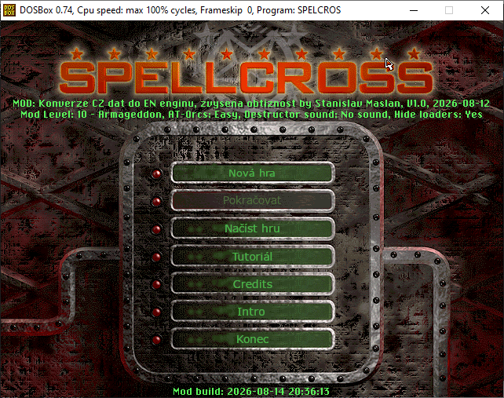
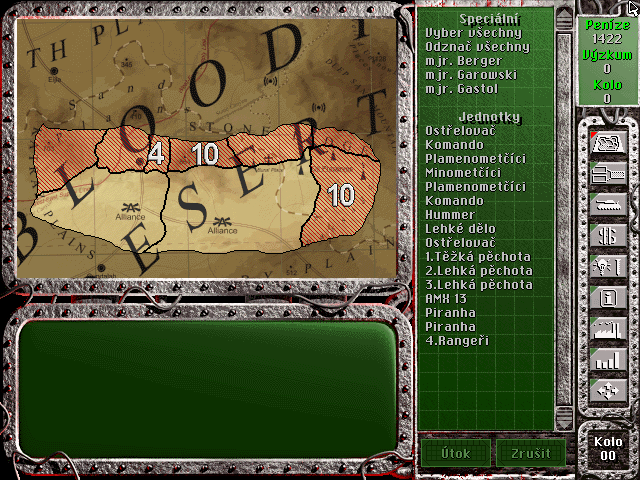
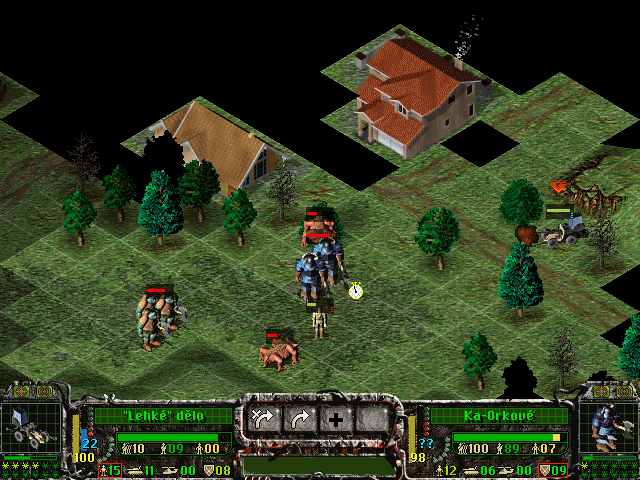
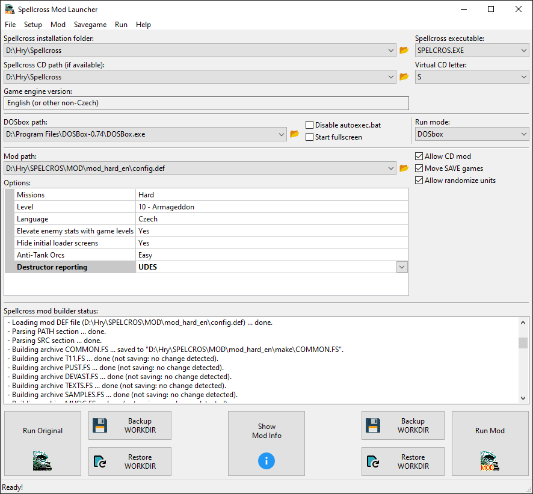

# Spellcross Mod: Port CZ dat pro EN engine

Jedná se o mod ke hře [Spellcross](https://wikipedia.org/wiki/Spellcross) určený pro můj nástroj [Spellcross Mod Launcher](https://github.com/smaslan/Spellcross-Mod-Launcher). 
Předně jde o kompletní konverzi dat z originální CZ verze hry pro EN engine. EN engine má proti původní CZ verzi pár vylepšení. Předně umožňuje skupinový pohyb jednotek. 
Dále také přidává některé grafické vylepšení jako animace smrti jednotek, které do CZ enginu nelze přidat díky limitaci velikosti UNITS.FSU souboru. 
Bohužel z EN verzi byla odstraněna řada misí. Proto jsem vytvořil tento mod, který do EN enginu portuje všechna CZ data.
Zároveň jsem také vše přeložil (alespoň doufám, že jsem na nic nezapomněl). Mod je naladěn pro obtížnost `veterán` (EN verze zná jen dvě: `začátečník` a `veterán`). Mod ale také zavádí také řadu dalších úprav:

- Doplnění vyřazených misí.    
- Opravy známých bugů v misích.
- Dvě nové jednotky: Lehké dělo a Sniper.
- Pár nových položek k výzkumu.
- Překlad všech textů do CZ.
- Nahrazení EN dabingu českým, protože EN verze dost hobluje uši.
- Konverze CZ videí pro EN engine. Zde došlo k jisté ztrátě kvality, protože CZ engine používá proprietární formát, zatímco EN verze klasický Smacker. Díky tomu bylo nutné nahrát CZ videa přes DOSbox a následně je překódovat pomocí RAD Video Tools do SMK2. Ale koukat se na to dá a je to i o něco menší než originál.
- Zvýšení maximální XP jednotek hráče. Jednotky získávají zkušenost podstatně pomaleji, takže nejsou na levelu 12 skoro od začátku (to byla potom dost nuda).
- Poladění vlastností jednotek hráče: např. vyšší dosah pro Roland.
- Poladění vlastností jednotek nepřítele: např. skoro všechny jednotky mohou útočit na vzdušné cíle, protože to jinak bylo v pozdních fázích hry příliš jednoduché.
- Poladění vlastností vylepšení: např. menší bonus pro Terminátora (to byl dost overkill) a vyšší ceny.
- Volitelná vyšší obtížnost misí: maximalizace počtu jednotek a zvýšení jejich XP hned od začátku.
- Volitelná vyšší tuhost nepřátel: postupné zvyšování síly nepřítel s každým dalším levelem hry, aby hra zůstala zábavná i ke konci.    
- Volitelná randomizace jednotek: v některých misích se při spuštění modu randomizují typy některých jednotek, aby to nebylo pořád stejné a předvídatelné.

## Instalace a použití

Předně je třeba si někde obstarat funkční EN verzi hry. Oficiálně se asi dnes již sehnat nedá, takže je třeba pohledat. Ideální je verze, která po instalaci má všechny datové soubory (*.FS a *.FSU) ve složce DATA.
Některé verze vyžadují i po instalaci CD a část souborů zůstane na CD (hlavně objemný MOVIE.FS). ISO CD pochopitelně nelze jednoduše modifikovat, takže je třeba kopírovat jeho obsah do nějaké složky na disku a následně ji podstrčit 
[Spellcross Mod Launcheru](https://github.com/smaslan/Spellcross-Mod-Launcher). Ten ji přes DOSbox namontuje jako virtuální CD. Ne vždy to ovšem hra akceptuje. Proto existují i pro EN verzi patche (nebo crack), které
detekci CD zneškodní. Chce to prostě hledat a vyzkoušet. Základní no-CD patch je integrován přímo v [Spellcross Mod Launcheru](https://github.com/smaslan/Spellcross-Mod-Launcher), takže tohle není třeba pro EN verzi řešit. 

Po získání funkční verze hry je třeba stáhnout nástroj [Spellcross Mod Launcher](https://github.com/smaslan/Spellcross-Mod-Launcher) a [DOSbox](https://www.dosbox.com/index.php) a vyzkoušet, že to vůbec funguje bez modu.

Samotný mod stačí stáhnout a někam rozbalit. Je ale velmi vhodné mít ho na stejné diskové jednotce jako hru! Díky tomu se modifikované soubory fyzicky nekopírují, jen se přepisují reference v alokačních tabulkách souborového systému. V opačném případě by docházelo při každém spuštění hry ke kopírování asi 250MB dat tam a zpět za což Vám SSD disk rozhodně nepoděkuje. Při dnešních cenách bych si na to dal pozor.

> [!WARNING]
> Pokud v [Spellcross Mod Launcheru](https://github.com/smaslan/Spellcross-Mod-Launcher) používáte option `Move SAVE games`, budou vaše uložené pozice ve složce modu namísto ve složce hry, takže pokud si stáhnete novou verzi modu, tak si nezapoměňte někam udělat ZÁLOHU ULOŽENÝCH POZIC, než starou verzi modu smažete nebo přepíšete!!! Toto řešení bylo vytvořeno, aby se vzájemně nekompatibilní uložené pozice různých modů a nativní hry nemíchaly, ale je potřeba nezapomínat, kde ty uložené pozice jsou. Jsou vždy v podsložce `save` ve složce modu, takže si je někam zkopírujte nebo rozbalte aktualizovaný mod do jiné složky a `save` složku za staré verze do něj přesuňte. Pokud používáte k aktualizaci modu přímo Git, tak toto řešit nemusíte, protože save není součástí tohoto Gitu. Pokud použijete git-pull, tak se vám aktualizují pouze data modu a ne save.  

## Nastavení

Mod měl být původně jednoduchý s pevným nastavením, ale postupně jsem do něj implementoval přepínače, které umožňují jeho vlastnosti parametrizovat. Dostupná nastavení aktuální verze jsou následující:

- `Missions` - Lze zvolit původní neupravené mise CZ hry `Normal` nebo upravené mise s maximálním počtem jednotek a vyšším XP `Hard`. Zkušeným jednoznačně doporučuji `Hard`.    
- `Level` - Toto nastavení by se mělo načíst samo podle poslední uložené pozice ve WORKDIR. Lze ho ale měnit i ručně a pro novou hru je to třeba udělat. Tento parametr je modem používán k postupnému zvyšování síly nepřátel.
- `Language` - Lze zvolit jazyk. Tento option není kompletní, protože v EN verzi chybí některé texty, takže použití EN verze bez záruky. Každopádně to ale v EN verzi ponechá původní videa, text a dabing.
- `Elevate enemy stats with game levels` - Aktivuje postupné zvyšování síly nepřátel s levelem hry. Zkušeným jednoznačně doporučuji zapnout. Funkce se pochopitelně projeví vždy až po novém spuštění hry, takže při přechodu na nový level je třeba hru restartovat.
- `Hide initial loader screens` - Odstraní úvodní animace hry. Dívat se na ně 50x je trochu otrava, ale proti gustu...    
- `Anti-tank Orks` - Některé verze hry mají pro AT-Orky bonus útoku na těžké jednoty kdy prakticky co výstřel to zničený tank bez ohledu na obranné číslo. To může zkazit den. Bohužel tento bonus je napevno zadrátován v binárce hry, ale porařilo se mi ho zneškodnit prohozením jednotek v JEDNOTKY.DEF, takže pokud chcete původní obtížnost originální CZ verze bez patche, tak lze nastavit hodnotu `Easy`.
- `Destructor reporting` - Destruktory mají poněkud iritující dabing. Tímto parametrem ho lze buďto vypnout nebo nahradit za snesitelnější `UDES`. 

## ČKD

- `Nebyl by link na EN verzi hry?` - Nebyl. Nejsem si úplně jistý, jak je to s legálností různých kopií, co se válí po netu, takže bych je zde nerad odkazoval. Vlastně ani nevím, kde jsem sebral tu mojí verzi.
- 'Mod nejde spustit, hlásí to chybu' - Se stává. [Spellcross Mod Launcher](https://github.com/smaslan/Spellcross-Mod-Launcheru) jsem se snažil udělat tak, aby to do toho bílého okna `Spellcross mod builder status` vypsalo chyby a občas i co s tím můžete udělat. Obvyklá chyba např. je, že nelze přesunout složku save game, což je způsobeno tím, že máte někde v průzkumníku nalistovanou složku se savy, která se má přesunout. To Windows nerad. Další chyby mohou vzniknout při nekompatibilní verzi hry (použijte patcher integrovaný v [Spellcross Mod Launcheru](https://github.com/smaslan/Spellcross-Mod-Launcheru)). 
- `Jak byl mod vytvořen?` - Vrtám se v tom příležitostně asi 20 let, takže jsem už celkem pochopil formát všech souborů hry. Pro vlastní editaci misí a řadu dalších úprav jsem použil můj [Spellcross Map Editor](https://github.com/smaslan/spellcross-map-edit) a také další nástroje dostupné na mém [webu](https://spellcross.kvalitne.cz). Použití samotného [Spellcross Mod Launcheru](https://github.com/smaslan/Spellcross-Mod-Launcheru) a syntaxe definičního souboru modu je popsána v jeho manuálu. 
- `Šlo by to spustit v CZ verzi hry?` - Bez úprav ne. CZ engine má nekompatibilní formát definičních souborů jednotek JEDNOTKY.DEF, jiný formát videa a limitovanou kapacitu UNITS.FSU s grafikou jednotek, takže se tam nevejdou animace smrtí jednotek. Musel bych implementovat nějaký runtime konvertor formátu, takže možná časem. Vzhledem k zásadním úpravám neoficiálního patche od HonzaQ (intergrován v [Spellcross Mod Launcheru](https://github.com/smaslan/Spellcross-Mod-Launcheru)) už ale nemá smysl se CZ verzí zabývat.
- `Šlo by tam něco přidat?` - Ano, dělá se na tom. V patchnuté verzi herního engine je asi 36 slotů na nové jednotky, 50 volných položek k výzkumu a 40 slotů pro vylepšení. Jen něco vymyslet/udělat. 
- `Lze ještě zvýšit počet jednotek v misích?` - V podstatě ně. Spellcross umožňuje maximálně 50 statických jednotek. Další jednotky lze generovat dynamicky přes eventy, ale maximálně jich v jednu chvíli může být pořád jen 50 a ne vždy lze eventy rozumně umístit, aby počet nepřekročil 50. To jsem udělal v misích, kde je postup hráče jasně daný terénem, ale špatně se to dělá ve velkých otevřených mapách. Pak se mohou jednotky spawnovat hráči za zadkem. 
- `Proč nejede hudba?` - Některé verze EN enginu zřejmě v rámci cracknutí odstranily podporu MIDI hudby, takže prostě nejede i když mod přidává původní MUSIC.FS. Nebo to možna z EN verze odtranili sami autoři? Těžko říct.
- `Co dělat když dojdou peníze?` - Pokud během hraní modu díky vysoké obtížnosti není dostatek prostředků na výzkum nebo nábory, lze použít save game editor [Spellcross Mod Launcheru](https://github.com/smaslan/Spellcross-Mod-Launcheru) a prostě si nějaké přidat nebo rovnou odemknout výzkumy. Sám jsem to během testování používal a podle toho jsem zpětně navyšoval prostředky z jednotlivých území, aby to bylo hratelné. 
- `Zbývá mi moc pěněz, nemělo by se ubrat?` - Může být, možná to tam dám jako option. Obtížnost/prostředky byly nastaveny na přiměřeně dynamický styl hraní, tj. jen pár dělostřelectev a zbytek tanky, transportéry a pěchota a předpokládá se pohyb a manévry, ne kempení a nekonečné vylákávání nepřátel. Pokud to budete hrát s mraky děl jako nejmenovaný Youtuber (;-), tak vám asi zbude hodně peněz, ale tento styl hraní je podle mě dost nuda, takže tomu nechci mod přizpůsobovat. Navíc je mod laděn na obtížnost "Veterán", kde je výrazně zvýšená pravděpodobnost permanentních ztrát, takže je třeba neustále dělat nábory a ty jsou díky XP našich jednotek velmi drahé, takže požerou snadno 1000+/level.   
 

## Download

Máte několik možností. Jednou za čas, když mám pocit, že je mod v hratelném stavu, udělám zip a nahraju ho svůj web. Nědělám to ale moc často, protože datové uložiště nění nafukovací. Odkazy na jednotlivé zipy jsou níže.

Druhá možnost je naučit se používat Git, klonovat tento repozitář a průběžně si mod aktualizovat pomocí git-pull. Nicméně upozorňuji, že mod může obsahovat nějaké rozpracované změny a nemusí být hratelný, takže doporučuji před aktualizací kontrolovat historii commitů. Ale je to verzovací systém, takže se můžete kdykoliv vrátit do kteréhokoliv stavu. Případně také můžete stáhnout git jako ZIP přes `Code->Download ZIP`.

Dostupné buildy:
- [V1.0, 15. Srpna 2026 (zip file)](https://spellcross.kvalitne.cz/mod/mods/hard_cz/spellcross-mod-cz-hard-v1.0.zip)
  - První verze.
  - Není zatím plně testovaná, ale zkusil jsem to dohrát a šlo to.
  - Předně se dá čekat, že nebude dostatek peněz na nábory jednotek, pokud nebudete hrát dost opatrně.
  - Možná někde haprují některé texty - je jich fakt hodně.   
- [V1.02 beta, 28. Srpna 2026 (7zip file)](https://spellcross.kvalitne.cz/mod/mods/hard_cz/spellcross-mod-cz-hard-beta.7z)
  - Beta verze.
  - Průběžně aktualizováno, drobné úpravy.
- [V1.2, 4. Rijna 2026 (7zip file)](https://spellcross.kvalitne.cz/mod/mods/hard_cz/spellcross-mod-cz-hard-v1.2.7z)
  - Nová verze s poladěnými misemi pro level 1 až 4 (poušť).
  - První verze, která vyžaduje HonzaQ patch herního engine (viz. [Spellcross Mod Launcheru V1.47+](https://github.com/smaslan/Spellcross-Mod-Launcheru))!
                                 
## Licence

Asi žádná? Autorská práva na původní souboru hry patří vývojářům/vydavateli? 
  
  
